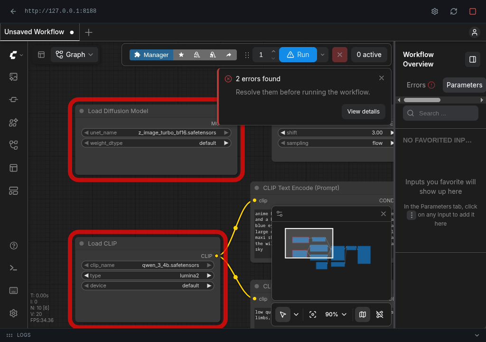

# unofficial comfyui launcher

An Arch / CachyOS AppImage that installs and runs [ComfyUI](https://github.com/comfyanonymous/ComfyUI) — no terminal.

> Independent launcher. Not affiliated with, endorsed by, or sponsored by Comfy Org. ComfyUI is a trademark of Comfy Org.


## What it does

- Installs ComfyUI into `~/ComfyUI` (first run) — clones the repo, creates a Python 3.11 venv via [uv](https://docs.astral.sh/uv/), installs CUDA PyTorch, then [ComfyUI-Manager](https://github.com/Comfy-Org/ComfyUI-Manager).
- Runs ComfyUI inside the app: start / stop / open, embedded view, live logs, and a settings panel.
- Never calls system `python` — only `{install}/.venv/bin/python`.



## Install

1. Prereqs (one time): `sudo pacman -S webkit2gtk-4.1` and an NVIDIA driver.
2. Download the AppImage from [Releases](https://github.com/Arkaikus/unofficial-comfyui-launcher/releases).
3. `chmod +x Unofficial.ComfyUI.Launcher_0.1.4_amd64.AppImage` and run it.

The first launch installs ComfyUI. A progress stepper shows each phase: checking environment → downloading ComfyUI → creating the Python environment → installing dependencies → installing extensions → verifying.

## Use

- **Install** — first-time setup (or repair an existing tree).
- **Repair** — re-pull the repo, refresh the venv, and reinstall deps.
- **Start / Open** — launch ComfyUI and open the embedded view; the top bar has Back / Settings / Reload / Stop, and the bottom bar has a collapsible log drawer (All / App / Install / Exec scopes).
- Extra nodes install from the ComfyUI Manager inside the app.

Default install path: `~/ComfyUI`. Existing trees can be used, repaired, or wiped.

## Dev

```sh
bun install
bun run tauri:dev
```

```sh
bun run lint
bun run typecheck
bun run test
cd src-tauri && cargo test
```
